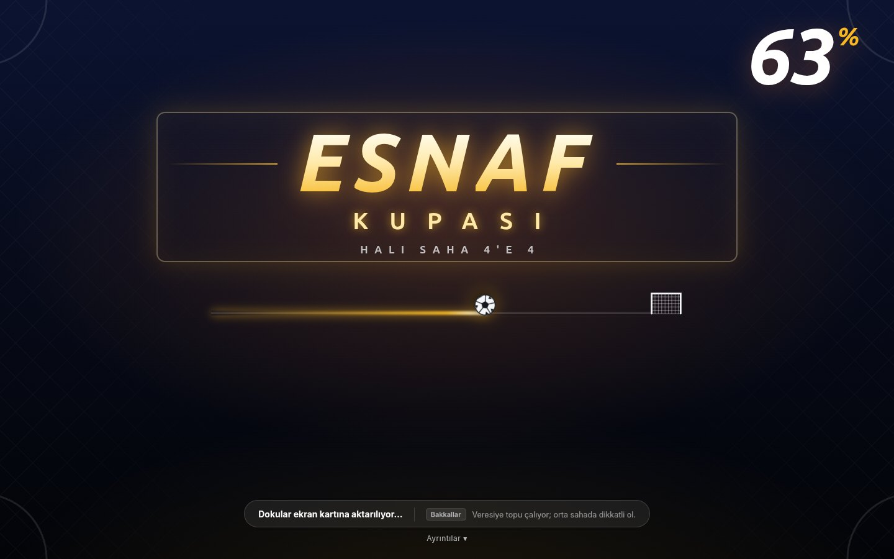
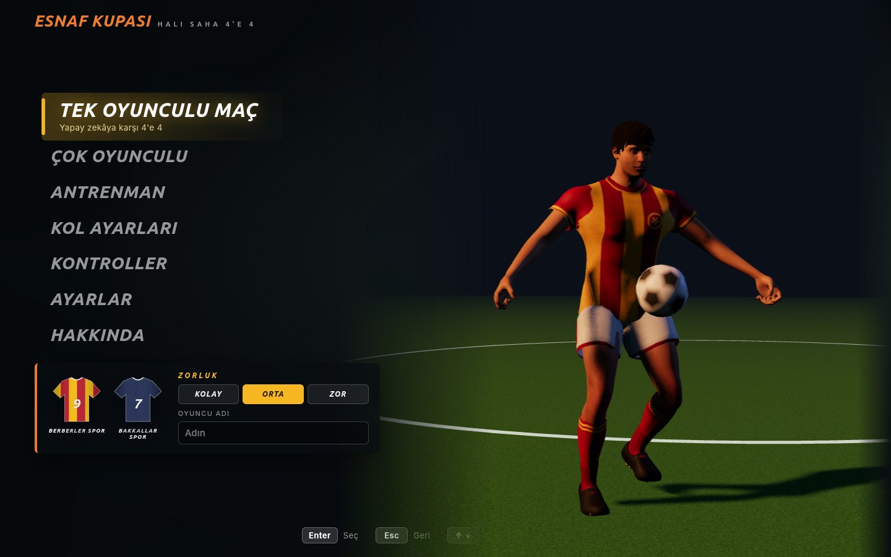
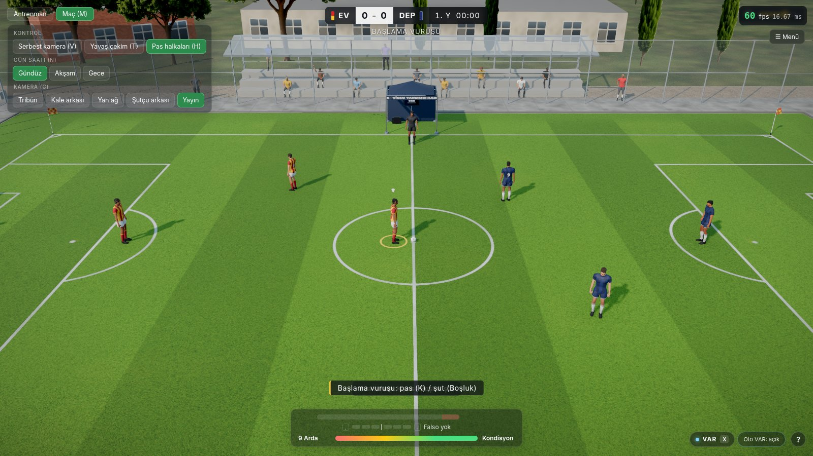
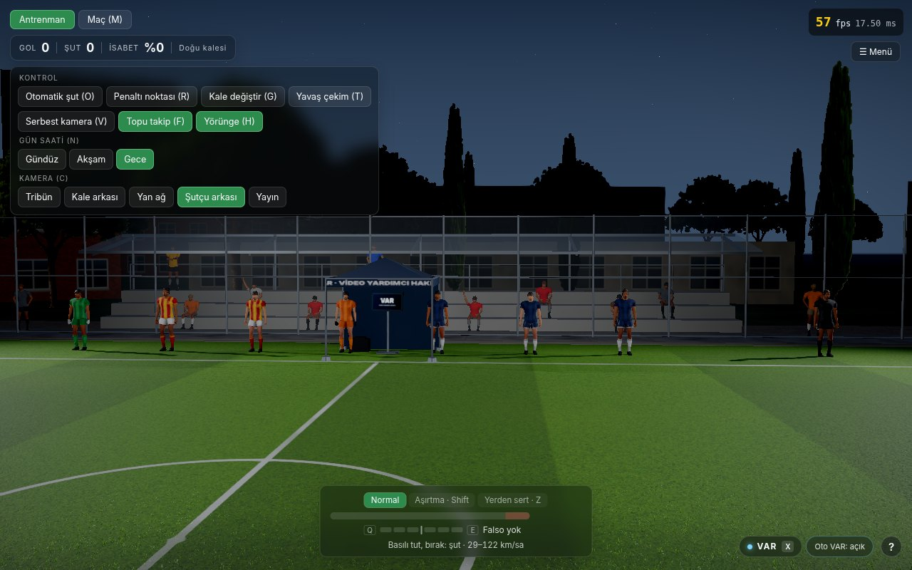
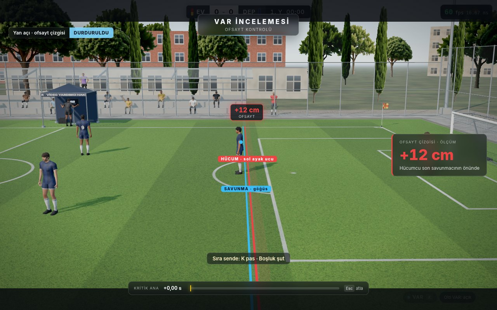
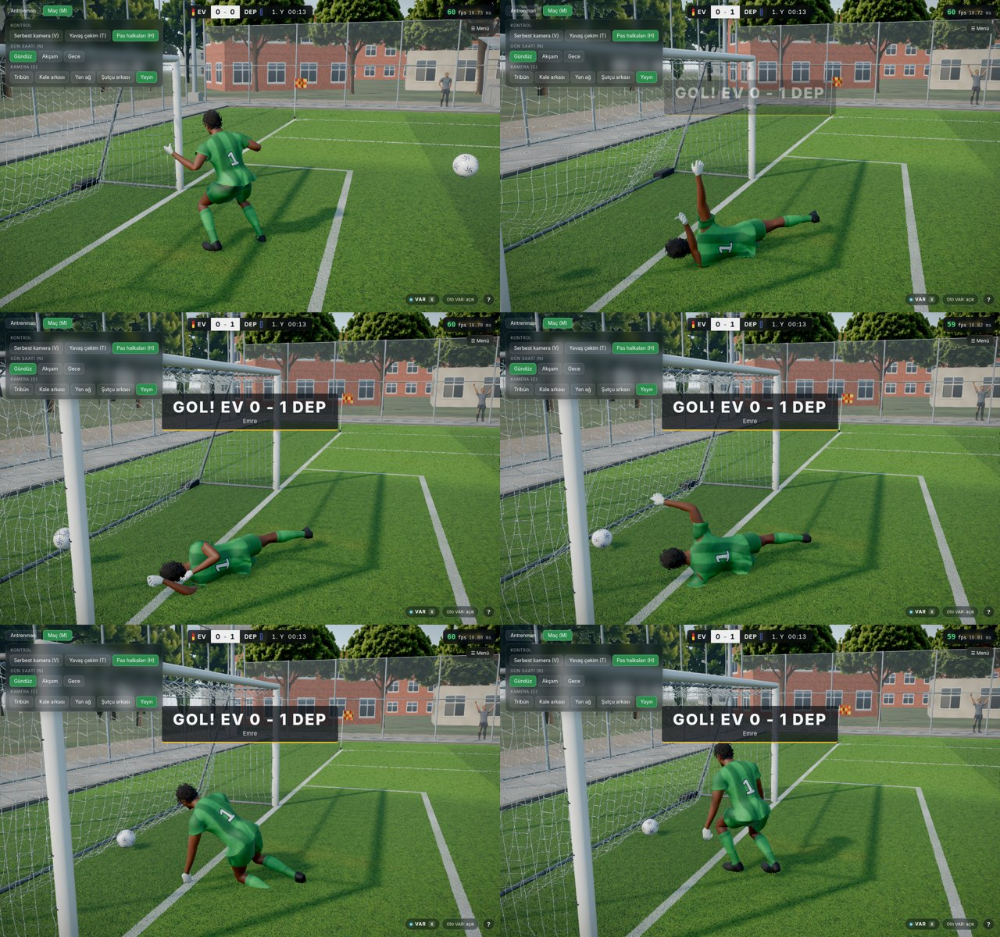
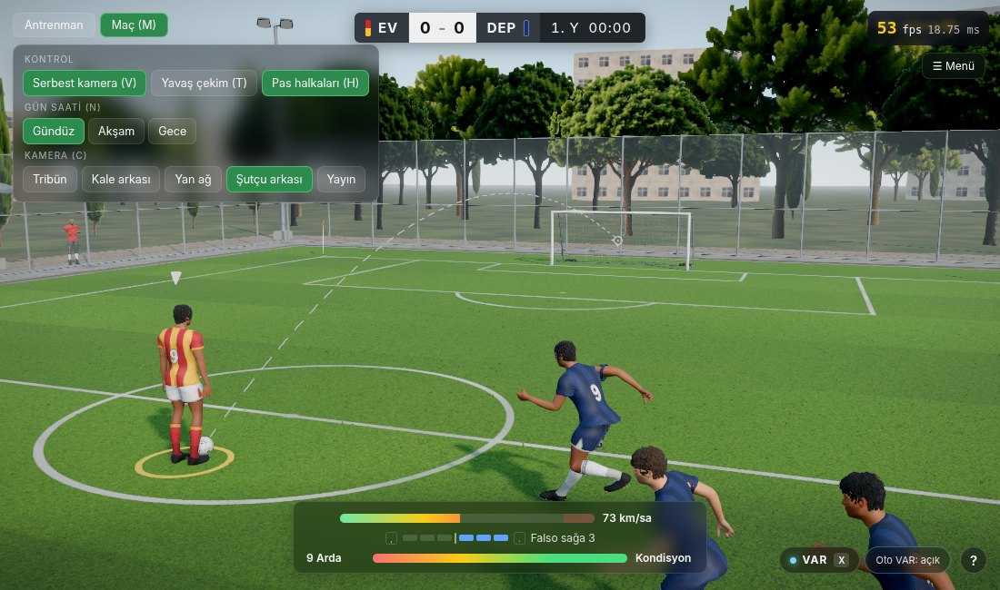
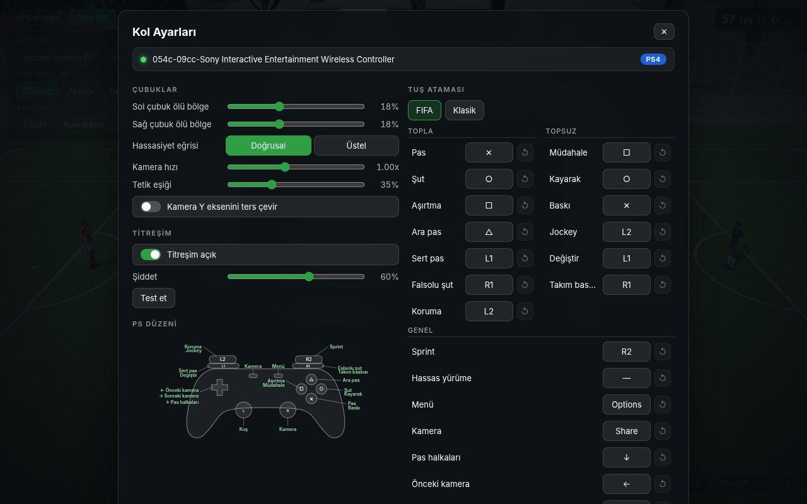

# Esnaf Kupası · Halı Saha 4'e 4

Tarayıcıda oynanan, gerçekçi 4'e 4 halı saha futbol oyunu. Tel örgülü sahada berberler ile bakkallar karşı karşıya; ağ, top, kaleci, hakem ve VAR fiziği gerçek zamanlı çalışıyor.

**Oyna:** https://egerberkuslu.github.io/footballer-4v4-play/

Bu depo yalnızca derlenmiş oyunu içerir. Üç boyutlu grafik için WebGL destekli güncel bir tarayıcı gerekir (Firefox ve Chrome denendi). İlk açılışta yaklaşık 56 MB indirilir.

## Öne çıkanlar

- **Gerçek zamanlı fizik:** zincir ve ip mantığıyla örülen kale ağı, Magnus etkili falsolu top, kalecinin topun gideceği yere planlı dalışı.
- **Hakem, faul ve kartlar:** ayakta ve kayarak müdahale, sarı ve kırmızı kart. Kırmızı kart 30 saniyelik ceza demek: oyuncu dışarı çıkar, takım 4'e 3 oynar, süre bitince döner.
- **VAR:** yalnızca çok ince pozisyonlarda: kale çizgisinde 6 cm, ofsayt çizgisinde 30 cm içinde. Hakem monitöre yürür, tekrar oynatılır. Ofsayt ölçümünde yalnız baş, gövde ve bacak sayılır, kollar sayılmaz.
- **Duran toplar:** taç, korner, serbest vuruş ve penaltıda kullanan oyuncunun en çok 3 saniyesi vardır. Kalecinin topu elinde tutması da en çok 3 saniyedir.
- **Çok oyunculu:** oda kodu ile P2P bağlantı (PeerJS).
- **PS4 / DualSense kolu:** FIFA düzeninde bağlam duyarlı tuşlar, kolla tüm menüyü gezme, yön testi ve tuş atama (Menü > Kol Ayarları).

## Kontroller

| | Klavye | Kol (FIFA düzeni, topla) | Kol (topsuz) |
|---|---|---|---|
| Hareket | WASD / oklar | sol çubuk | sol çubuk |
| Pas | K | ✕ | |
| Şut | Boşluk (basılı tut: güç) | ○ | |
| Falso | tekerlek veya `,` `.` | ○ basılıyken sol çubuk, R1+○ özel falsolu şut | |
| Orta / aşırtma | Z + pas ya da şut | □ | |
| Ara pas / sert pas | | △ / L1+✕ | |
| Sprint | Shift | R2 | R2 |
| Müdahale | E | | □ |
| Kayarak müdahale | E E (çift dokunuş) | | ○ |
| Oyuncu değiştir | Q | | L1 |
| Koruma / jockey | | L2 | L2 |

## Dürüst notlar

- PS4/DualSense desteği gerçek bir kolla denenmedi, yalnız sahte kol testleriyle sınandı. Yön ters çıkarsa Menü > Kol Ayarları > Yön testi.
- Çok oyunculu bağlantı halka açık ücretsiz bir sinyal sunucusuna dayanır; katı kurumsal ağlarda bağlantı kurulamayabilir.
- Mobil ve dar ekran görünümü sınanmadı.
